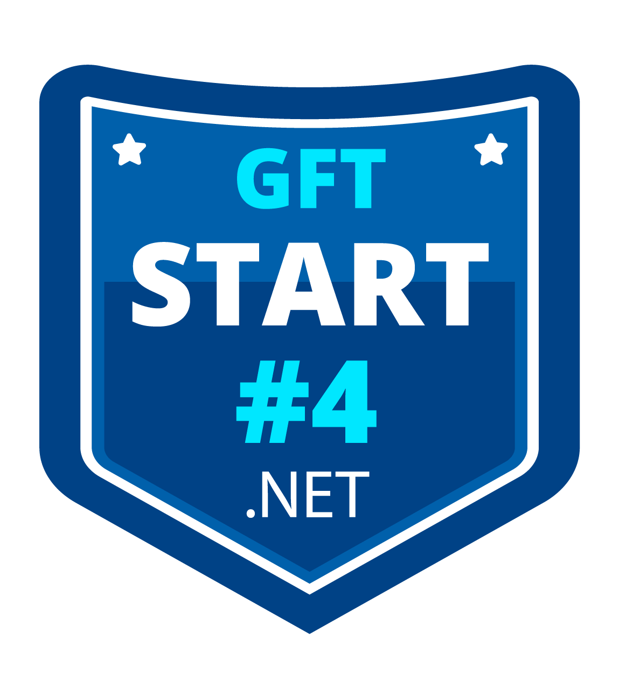
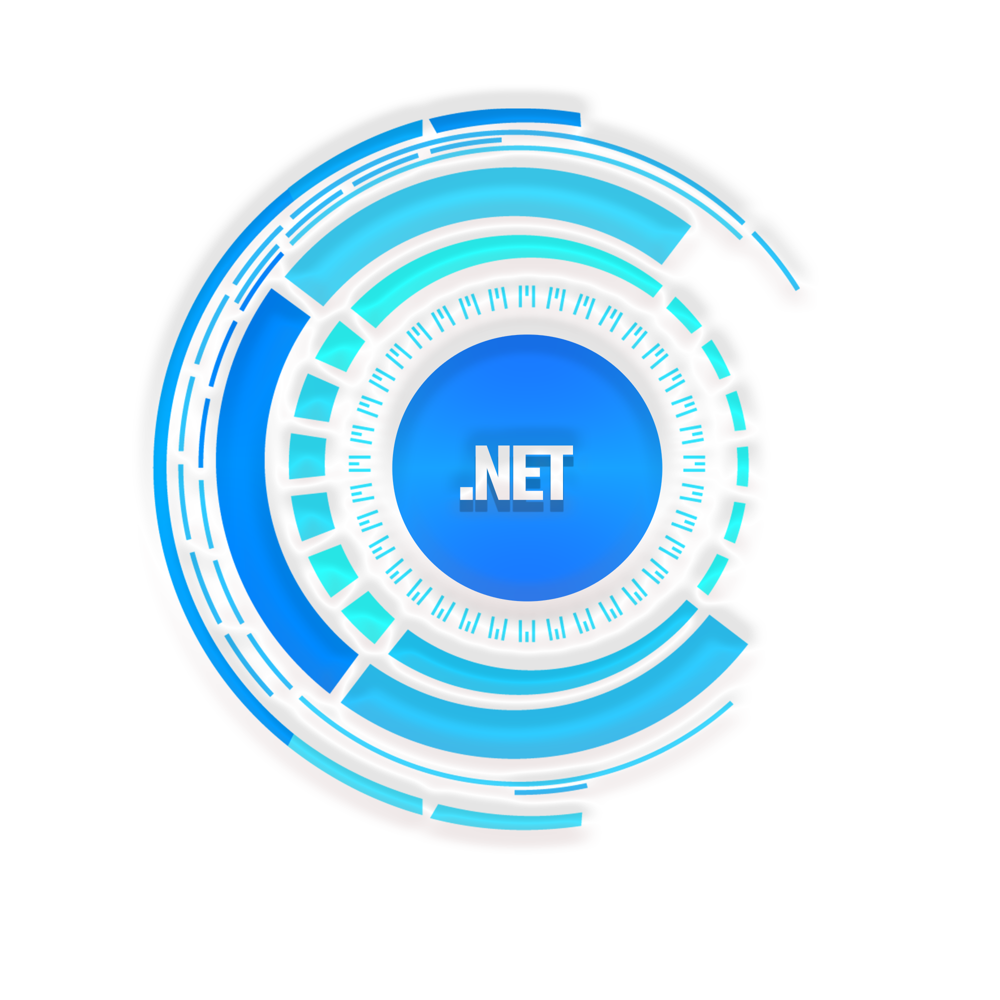
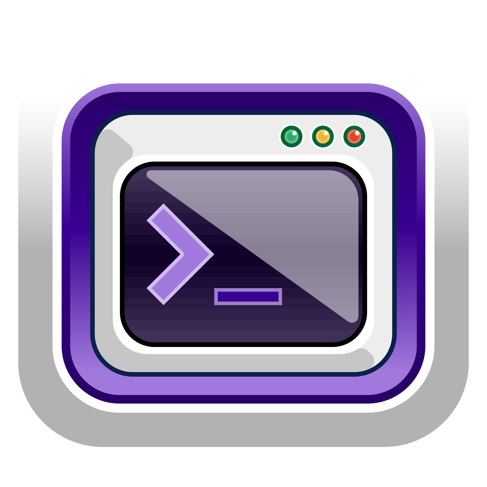
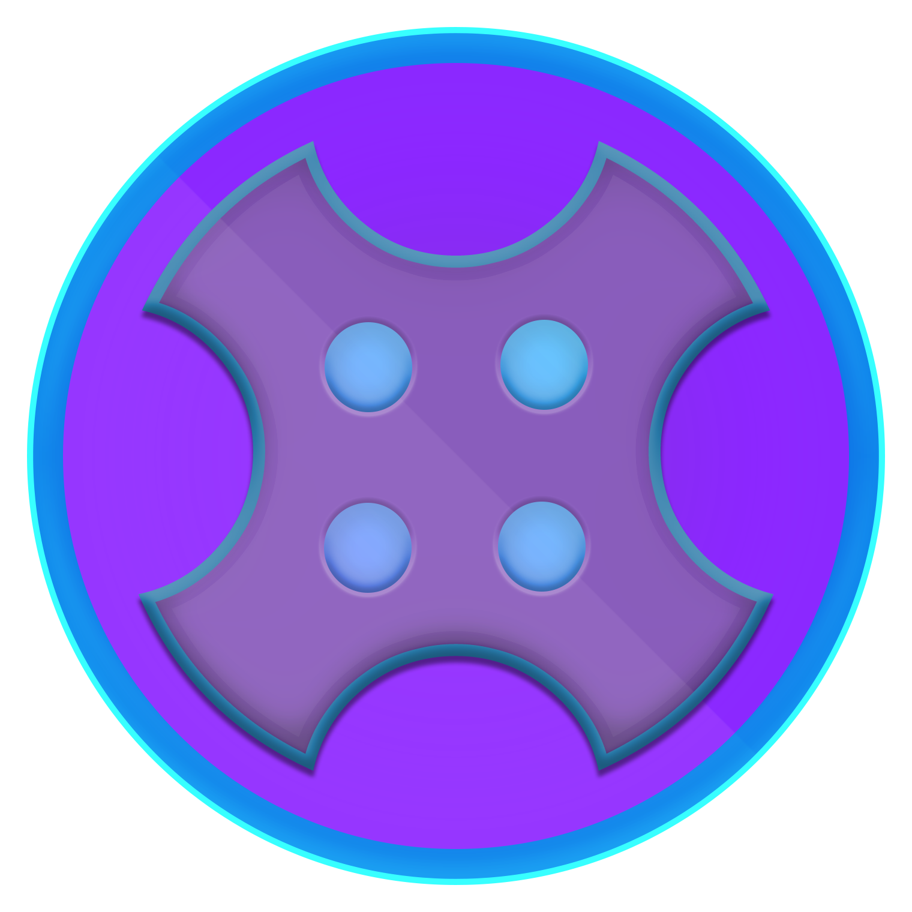
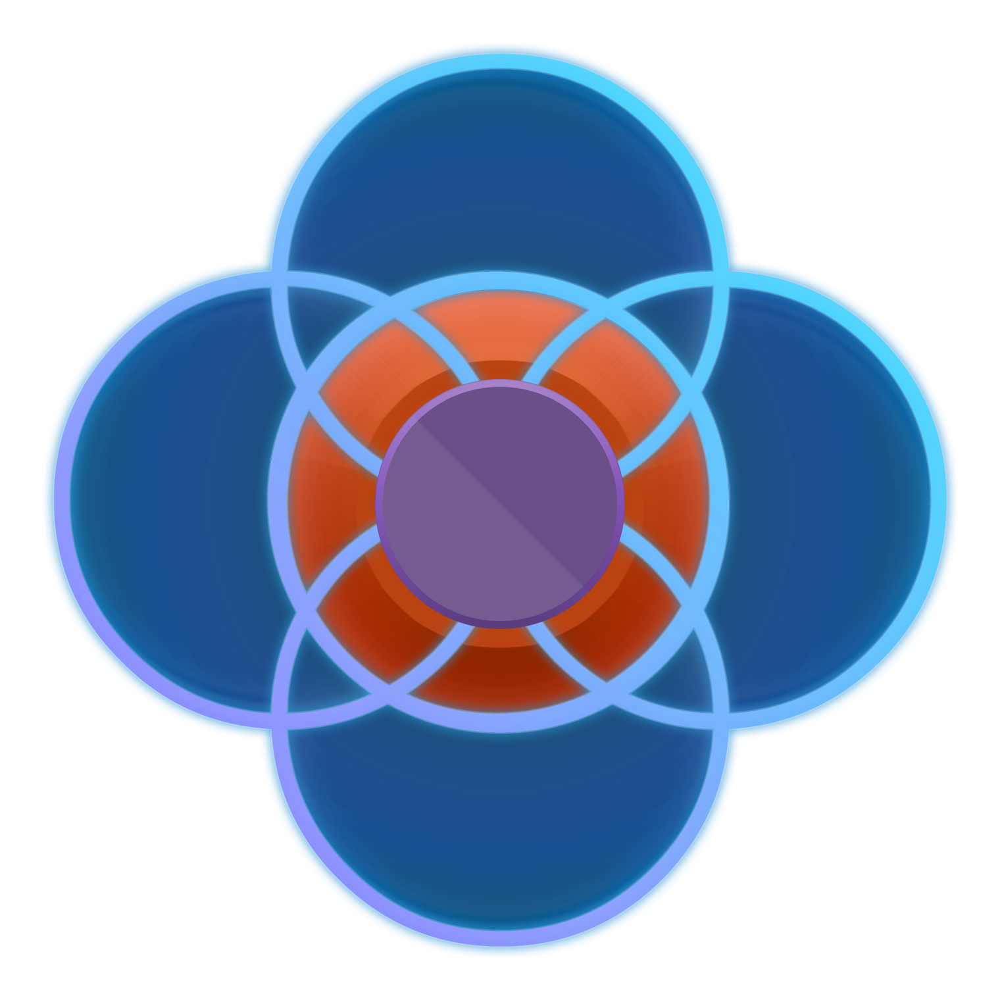

# GFT Start #4 .NET

  

### GFT Start #4 .NET

  
  
  
  
  
  
  
  
  
  
  
  
  

## 📚 Módulos

🔖 [Boas-vindas ao Bootcamp GFT Start #4 .NET]() 
🔖 [Lógica de Programação Essencial]() 
🔖 [Aprenda o que são Estrutura de Dados e Algoritmos]() 
🔖 [Introdução ao Git e ao GitHub]() 
🔖 [Criando seu Primeiro Repositório no GitHub Para Compartilhar Seu Progresso]() 
🔖 [Introdução ao Ecossistema .NET e Documentação]() 
🔖 [Criando o ambiente de desenvolvimento]() 
🔖 [IDE Instalação e Configuração (Visual Studio Code)]() 
🔖 [Primeiros passos com .NET]() 
🔖 [Trabalhando com Tipos de Referência e Valor em C#]() 
🔖 [Controlando o Fluxo de Execução]() 

## 🛠 Tecnologias Usadas
 

  
  
  

